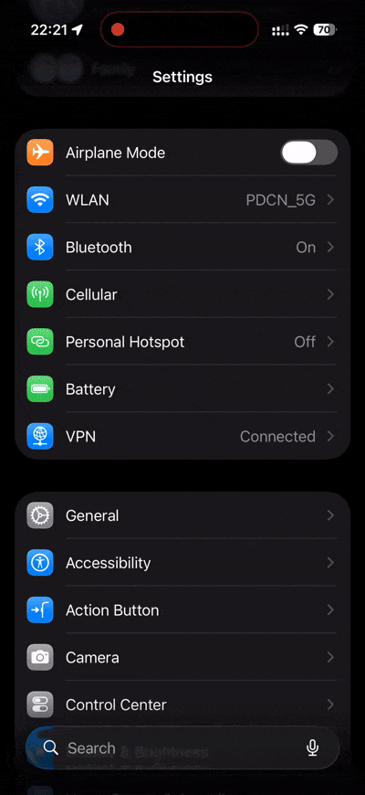
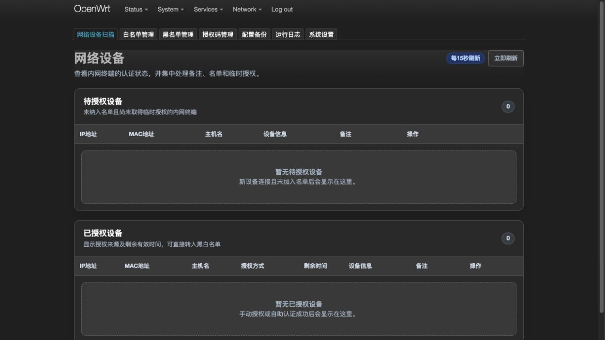
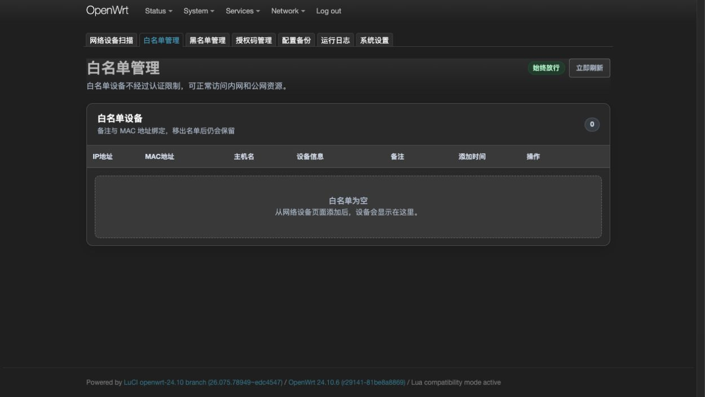
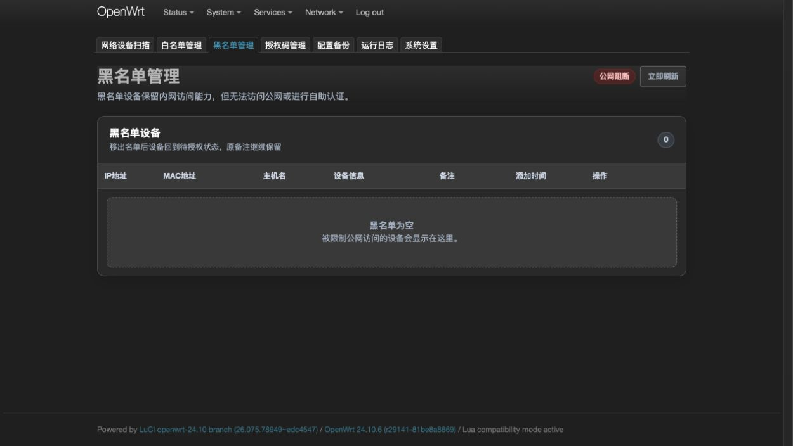
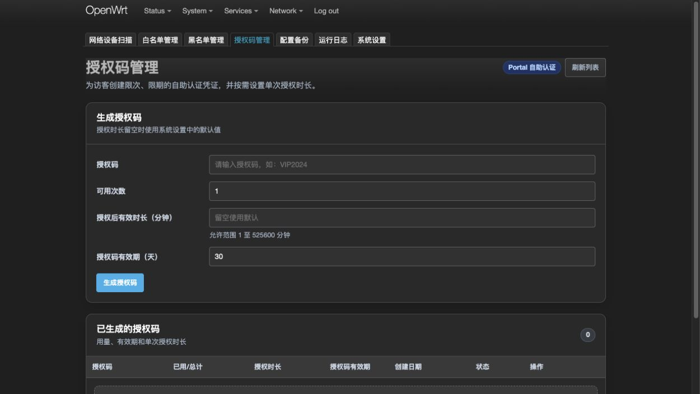
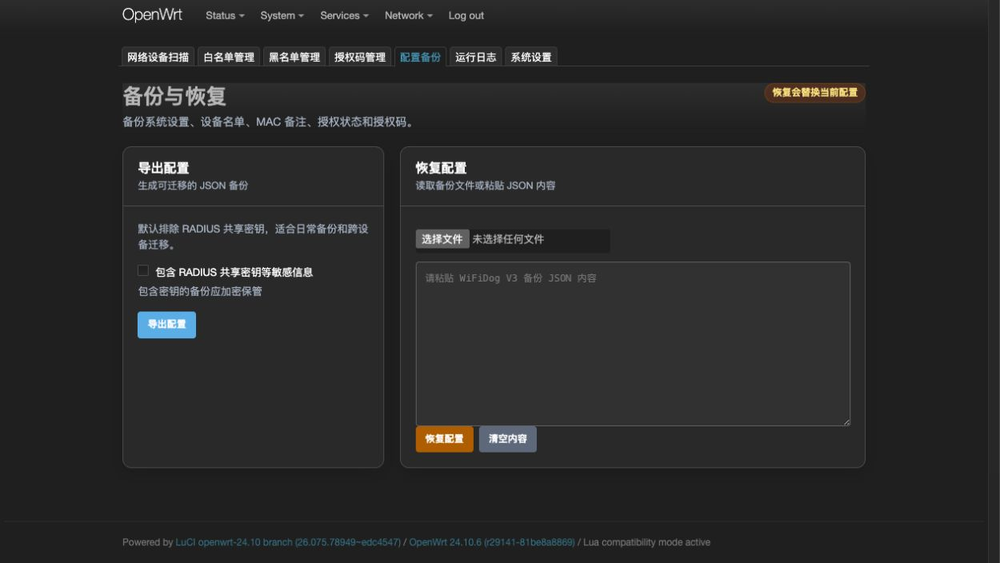
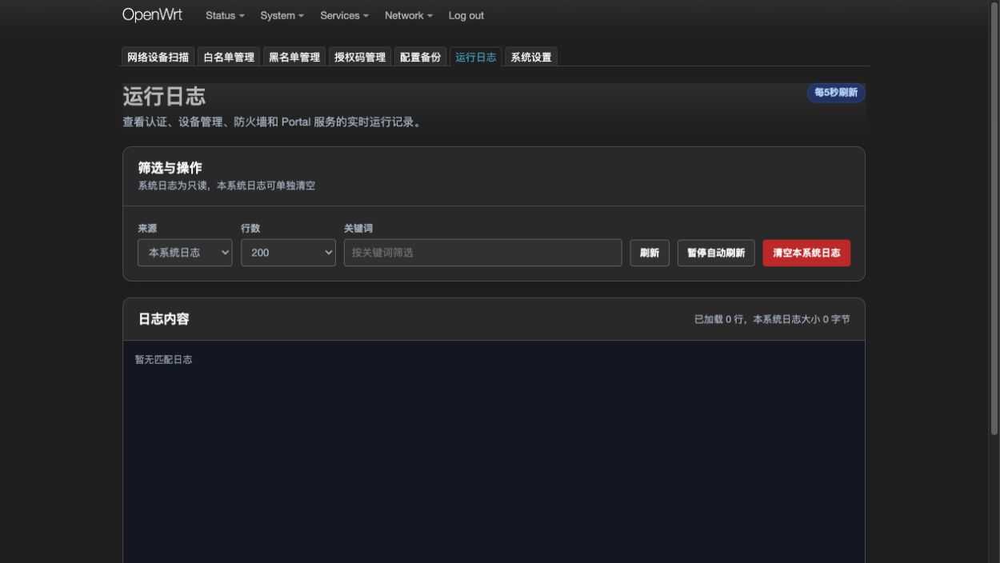
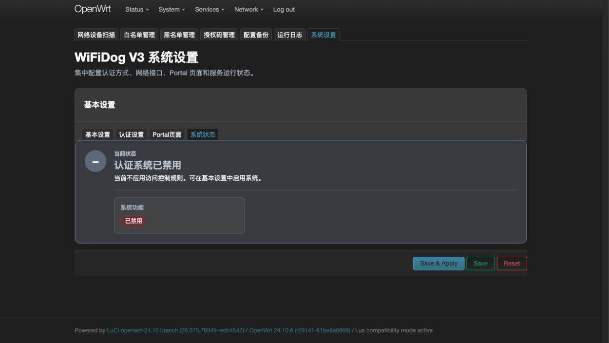

# WiFiDog V3

[English](README_en.md)

WiFiDog V3 是一个面向 OpenWrt 的 LuCI 网络认证系统，用于在路由器上管理待授权设备、白名单、黑名单、授权码和 Captive Portal 认证流程。

## 功能演示



## LuCI 管理后台截图

以下截图来自 UTM OpenWrt 24.10.6 环境中的 LuCI 实际页面。

### 网络设备扫描



### 白名单管理



### 黑名单管理



### 授权码管理



### 配置备份



### 运行日志



### 系统设置



## 功能特性

- 网络设备扫描：从 ARP 表和 DHCP leases 中识别内网设备。
- 设备名单管理：待授权、白名单、黑名单、已授权设备均支持备注，备注按 MAC 地址保留。
- 设备识别：访问 Portal 时记录 User-Agent，解析设备类型、系统、浏览器和可识别的设备型号，并随 MAC 地址保留。
- 白名单：设备访问内外网不受限制。
- 黑名单：设备可访问内网资源，禁止访问公网资源，Portal 页面仅提示被拉黑，不能自助授权。
- 手动授权：管理后台可授权设备默认 24 小时访问权限。
- 授权码：支持自定义授权码、可用次数、授权码有效期、单独授权时长、启用/停用和自助认证。
- FreeRADIUS：支持 RADIUS PAP 账号密码认证，可与授权码认证并存，并支持 `Session-Timeout` 控制授权时长。
- Captive Portal 兼容：
  - RFC 8908 Captive Portal API
  - RFC 8910 DHCP option 114
  - odhcpd captive portal URI
  - iOS、Android、Windows、NetworkManager 等旧探测路径
- Portal 页面：使用独立 uhttpd 实例，支持主题切换和后台自定义提示词、标题、按钮文案。
- 配置备份恢复：支持导入/导出系统设置、黑白名单、备注、授权码和 Portal 页面配置。
- 敏感配置保护：备份默认不包含 RADIUS 共享密钥，可按需显式导出完整配置。
- 运行日志：后台可查看本系统运行日志和相关 syslog，支持清空和 512 KiB 自动轮转。
- LuCI 后台：统一的响应式管理界面，支持深色模式，并针对桌面和移动端优化表格、表单和状态展示。
- Passwall2 共存：使用更早优先级的 nftables 规则，尽量在分流规则前完成认证控制。
- 安全卸载：卸载时清理 nftables、Portal 进程、DHCP/RA 广告、运行状态和配置文件。
- 安全加固：授权码计数使用跨进程事务锁，包含输入校验、请求体限制、安全响应头和服务启动失败回滚。

## v1.0.4 更新

- 将 `/etc/config/wifidog_v3` 正式声明为 conffile，IPK/APK 升级不再覆盖现有设置、名单、备注、授权码和 RADIUS 密钥。
- 升级后自动清理包管理器生成的 `wifidog_v3-opkg` 和 `wifidog_v3.apk-new` 默认配置副本。
- 重构 LuCI 管理后台样式，统一页面标题、状态计数、操作区、表格和表单，并增加响应式布局与深色模式。
- 增加真实 `v1.0.3 -> v1.0.4` IPK/APK 升级回归，覆盖配置保留、服务恢复和临时文件清理。

## v1.0.3 更新

- 删除旧的免登录 LuCI 认证入口，统一由独立 Portal CGI 执行黑名单和认证开关检查。
- 修复授权码管理页存储型 XSS 和异常 JSON 数组导致的页面错误。
- 授权码在确认客户端 MAC 后才计数；并发使用单次码时只允许一个请求成功。
- 临时授权过期后转回待授权状态，并保留 MAC 绑定的备注、主机名和 UA。
- nftables 或 Portal 启动失败时自动回滚防火墙和 DHCP/RA 广告。
- 未授权 HTTP 跳转 Portal；HTTPS/443 直接阻断，不进行不可靠的明文或自签名劫持。
- 增加日志轮转、16 KiB Portal 请求上限、浏览器安全响应头和 RADIUS 临时文件权限保护。

## 支持版本

已验证版本：

- OpenWrt 23.05.6 x86/64：IPK
- OpenWrt 24.10.6 x86/64：IPK
- OpenWrt 25.12.3 x86/64：APK

运行依赖：

- firewall4
- nftables-json
- lua
- uhttpd
- libuci-lua
- luci-compat
- luci-lib-jsonc
- luasocket

## 构建

构建 OpenWrt 23/24 IPK：

```sh
./build_ipk.sh
```

输出：

```text
dist/luci-app-wifidog-v3_1.0.4-1_all.ipk
```

构建 OpenWrt 25 APK：

```sh
./build_openwrt25_apk.sh
```

输出：

```text
dist/openwrt25/luci-app-wifidog-v3-1.0.4-r1.apk
```

## 安装

最新发布包：

- Release：<https://github.com/chmod740/wifidog-v3/releases/tag/v1.0.4>
- IPK：`luci-app-wifidog-v3_1.0.4-1_all.ipk`
- APK：`luci-app-wifidog-v3-1.0.4-r1.apk`

OpenWrt 23/24：

```sh
opkg update
opkg install /tmp/luci-app-wifidog-v3_1.0.4-1_all.ipk
```

OpenWrt 25：

```sh
apk add --allow-untrusted /tmp/luci-app-wifidog-v3-1.0.4-r1.apk
```

安装后进入 LuCI：

```text
服务 -> WiFiDog V3
```

也可以使用 init 脚本：

```sh
/etc/init.d/wifidog_v3 start
/etc/init.d/wifidog_v3 stop
/etc/init.d/wifidog_v3 restart
```

## 配置

主要 UCI 配置位于：

```text
/etc/config/wifidog_v3
```

该文件已由软件包声明为 conffile。直接安装新版 IPK/APK 进行升级时，已有配置、设备名单和备注会保留。

常用设置：

- `enabled`：是否启用系统
- `lan_interface`：LAN 接口
- `wan_interface`：WAN 接口
- `portal_port`：Portal 服务端口，默认 `8080`
- `lan_subnet`：内网网段
- `auth_code_enabled`：是否启用授权码认证，默认 `1`
- `auth_timeout`：授权时长，单位分钟，默认 `1440`
- `authcode.*.auth_minutes`：单个授权码使用后的授权时长，单位分钟；为空时使用 `auth_timeout`
- `device.*.user_agent` / `ua_summary`：Portal 记录的原始 UA 和解析出的设备摘要
- `radius_enabled`：是否启用 RADIUS 认证，默认 `0`
- `radius_server` / `radius_port` / `radius_secret`：FreeRADIUS 服务器地址、端口和共享密钥
- `radius_nas_id`：发送给 RADIUS 服务器的 NAS Identifier
- `radius_timeout` / `radius_retries`：RADIUS 请求超时和重试次数
- `portal_theme`：Portal 页面主题
- `portal_title`：Portal 页面标题
- `portal_prompt`：Portal 主提示词
- `portal_hint`：Portal 底部提示词
- `portal_button_text`：Portal 按钮文案

## 测试

Docker 回归：

```sh
python3 test/e2e_openwrt23_container.py
```

快速安全与源码契约测试：

```sh
python3 test/test_source_contracts.py
```

IPK 原位升级测试：

```sh
python3 test/test_ipk_upgrade.py
```

OpenWrt 25 / APK 模式：

```sh
PKG_MANAGER=apk python3 test/e2e_openwrt23_container.py
```

UTM 烟测脚本：

```sh
lua /tmp/utm_smoke.lua
```

最近回归结果：

- 源码契约测试：`37 passed, 0 failed`
- Docker OpenWrt 23.05.6：`124 passed, 0 failed`
- Docker OpenWrt 23.05.6：v1.0.3 到 v1.0.4 IPK 原位升级，设置、密钥、名单、备注和授权码全部保留
- UTM OpenWrt 24.10.6：v1.0.4 IPK 升级、Portal、RFC 8908/8910、设备识别、导入导出、授权码、RADIUS PAP、`Session-Timeout`、关闭和卸载清理通过
- UTM OpenWrt 25.12.3：v1.0.4 APK 安装与升级、Portal、RFC 8908/8910、设备识别、导入导出、授权码、RADIUS PAP、`Session-Timeout`、`.apk-new` 清理和卸载清理通过

UTM 24/25 卸载检查确认以下项目无残留：

- 软件包记录
- Portal uhttpd 进程
- `/www/wifidog_v3`
- `/www/cgi-bin/wifidog_v3`
- `/etc/config/wifidog_v3`
- `/etc/config/wifidog_v3.apk-new`
- `/var/run/wifidog_v3_portal.pid`
- `/var/lock/wifidog_v3_auth.lock`
- `inet wifidog_v3` nftables 表

## 卸载

OpenWrt 23/24：

```sh
opkg remove luci-app-wifidog-v3
```

OpenWrt 25：

```sh
apk del luci-app-wifidog-v3
```

卸载脚本会清理：

- `/etc/config/wifidog_v3`
- `/www/wifidog_v3`
- 独立 uhttpd Portal 进程
- `inet wifidog_v3` nftables 表
- `/tmp/dnsmasq.d/wifidog_v3.conf`
- `dhcp.lan.captive_portal_uri`
- `/tmp/wifidog_v3_ip_sessions`
- `/var/lock/wifidog_v3_auth.lock`
- `/var/log/wifidog_v3.log` 和轮转文件

## 注意事项

- 未授权设备的 HTTPS/443 会被阻断，不会尝试伪造目标站点证书或返回明文 Portal；认证页依靠 RFC 8910、系统探测 URL 和 HTTP 请求触发。
- iOS 认证弹窗关闭依赖系统重新探测网络状态，页面会轮询 Captive Portal API 并触发兼容探测作为兜底。
- 如果客户端启用随机 MAC，授权、备注和名单状态会绑定到当前随机 MAC。
